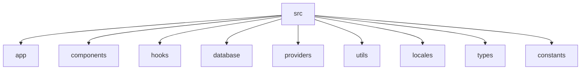

# DukkanOS Application Architecture

DukkanOS is a React Native mobile application built with Expo SDK 57, managing inventory, sales, and customer data for a small business. The architecture follows a clean separation of concerns with distinct layers for presentation, business logic, and data persistence.

## Folder Structure



**`src/app/`** — Expo Router file-based routing

- `(tabs)/` — Tab navigator screens (products, sell, customers, more, index)
- `products/[id].tsx` — Product detail screen
- `products/new.tsx` — New product screen
- `edit/[id].tsx` — Product edit screen
- `_layout.tsx` — Root layout composing all providers
- `explore.tsx` — Explore screen
- `onboarding.tsx` — Onboarding flow
- `index.tsx` — Entry point

**`src/components/`** — Reusable UI components

- `ui/` — Base UI components (buttons, inputs, cards, etc.)
- `AppHeader.tsx` — App header with title and actions
- `PrimaryButton.tsx` — Primary action button
- `SecondaryButton.tsx` — Secondary action button
- `SearchInput.tsx` — Search field component
- `Card.tsx` — Card component for grouping content
- `EmptyState.tsx` — Empty state screen
- `ErrorState.tsx` — Error display component
- `LoadingState.tsx` — Loading indicator
- `themed-view.tsx` — Themed view wrapper
- `hint-row.tsx` — Hint row with title and code snippet
- `themed-text.tsx` — Text component with theming
- `animated-icon.tsx` — Splash screen animation
- `web-badge.tsx` — Expo version badge

**`src/hooks/`** — Custom React hooks

- `useProducts.ts` — Product fetching & filtering state
- `useLocale.ts` — Locale management and language switching
- `use-color-scheme.ts` — Theme detection (light/dark)
- `useDebounce.ts` — Debounced value updates
- `useOnboarding.ts` — Onboarding state management

**`src/database/`** — SQLite database layer

- `database.ts` — Database initialization and setup
- `schema.ts` — Database schema definitions
- `migrations.ts` — Migration logic
- `query.ts` — Database query helpers
- `repositories/` — Repository pattern for data access
  - `productRepository.ts`
  - `customerRepository.ts`
  - `inventoryRepository.ts`
  - `exportRepository.ts`
  - `saleRepository.ts`
  - `businessProfileRepository.ts`

**`src/providers/`** — React context providers

- `AppProviders.tsx` — Compose `DatabaseProvider` + `LocaleProvider`
- `DatabaseProvider.tsx` — SQLite database context
- `LocaleProvider.tsx` — i18n context via `react-i18next`

**`src/utils/`** — Utility functions (pure, testable)

- `money.ts` — DZD currency formatting (`formatCentimes`, `parseCentimes`)
- `dates.ts` — Date formatting & relative dates
- `text.ts` — Text manipulation (Arabic support, truncation, digit conversion)
- `testing.ts` — Test utilities & mocks

**`src/locales/`** — i18n translation files

- `en.json` — English translations
- `fr.json` — French translations
- `ar.json` — Arabic translations

**`src/types/`** — TypeScript type definitions

- `entities.ts` — Product, Sale, Inventory types
- `common.ts` — Shared utility types

**`src/constants/`** — Application constants

- `theme.ts` — Color themes & palette (light/dark)

## State Flow

The application state follows a unidirectional data flow:

1. **Entry Point**: `src/app/index.tsx` renders the Expo Router root
2. **App Providers**: `src/app/_layout.tsx` wraps everything in `AppProviders`
3. **Database State**: `DatabaseProvider` manages SQLite database via context
4. **Locale State**: `LocaleProvider` manages i18n language via `react-i18next`
5. **Theme State**: `useTheme()` hook reads `useColorScheme()` from React Native
6. **Product Data**: `useProducts` hook fetches data from `productRepository`
7. **UI Components**: Consume context via `useLocale`, `useTheme`, or direct props

## Data Layers

### Presentation Layer

- **UI components** (`src/components/`) — Dumb components receiving props
- **Custom hooks** (`src/hooks/`) — Business logic separated from UI
- **Expo Router screens** (`src/app/`) — Navigation and screen composition

### Business Logic Layer

- **Repository pattern** (`src/database/repositories/`) — Abstracts data access
- **Utility functions** (`src/utils/`) — Pure functions for formatting, validation
- **Custom hooks** (`src/hooks/`) — React state management with side effects

### Data Layer

- **SQLite database** (`src/database/`) — Persistent storage via `expo-sqlite`
- **i18n system** (`src/locales/`) — Translation management via `i18next`
- **Persistence** — AsyncStorage/SQLite for user preferences

## Key Flows

### Product Listing Flow

1. Screen calls `useProducts()` hook
2. Hook triggers `loadProducts` callback
3. Repository method (`getAll` or `search`) queries SQLite
4. Results transformed with `lowStock`/`outOfStock` badges
5. State updated, UI re-renders with product list

### Locale Change Flow

1. `changeLocale(newLocale)` called from UI
2. Validates locale is supported (`ar`, `fr`, `en`)
3. `i18n.changeLanguage(newLocale)` — dynamic, no reload needed
4. Locale persisted in SQLite/AsyncStorage
5. `LocaleProvider` updates context for subtree

### Database Flow

1. Component mounts, `DatabaseProvider` init effect runs
2. `openDatabase()` creates/opens `dukkanos.db`
3. Schema tables created if not exist (sales, payments, inventory, settings)
4. Context value exposed via `DatabaseContext`
5. Repositories use `DatabaseContext` to query data

## Navigation

- Uses **Expo Router** with file-based routing
- Tab navigator defined in `src/app/(tabs)/`
- Deep linking configured in `app.json`
- Typed routes enabled (`typedRoutes: true`)
- Screen options: `headerShown: false` for tab bar

## Providers Composition

```
<AppProviders>
  <SafeAreaView>
    <DatabaseProvider>
      <LocaleProvider>{children}</LocaleProvider>
    </DatabaseProvider>
  </SafeAreaView>
</AppProviders>
```

- `AppProviders` composes `DatabaseProvider` and `LocaleProvider`
- `DatabaseProvider` opens `dukkanos.db` on mount, creates tables if not exist
- `LocaleProvider` initializes i18next with French as default language
- Detects device locale on first launch using `expo-localization`
- Persists selected locale in SQLite (merchant override)
- Language switching does NOT trigger RTL layout changes
- App remains visually LTR regardless of selected language

## Utilities Overview

| Utility | Purpose |
|---|---|
| `formatCentimes` | Format integer centimes to DZD string |
| `parseCentimes` | Parse DZD string back to centimes integer |
| `formatDate` | Format Date object using locale-specific Intl |
| `formatRelativeDate` | Format date relative to "today" |
| `getTextAlignment` | Return CSS `textAlign` for locale |
| `getWritingDirection` | Return CSS `writingDirection` for locale |
| `truncateText` | Safely truncate text with ellipsis |
| `toArabicIndicDigits` | Convert Latin digits to Arabic-Indic |
| `toLatinDigits` | Convert Arabic-Indic digits to Latin |
| `containsArabic` | Check if text contains Arabic characters |
| `containsRTL` | Check if text contains RTL characters |
| `textStyle` | Generate text style object for locale |

## Types Overview

| Type | Description |
|---|---|
| `Product` | Product entity with name, SKU, price, stock, unit |
| `ProductsFilters` | Filters for product queries (is_active, search, etc.) |
| `UseLocaleReturn` | Locale state: locale, isRTL, changeLocale, getCurrencyCode |
| `UseThemeReturn` | Theme state: color scheme, palette colors |
| `ProductsListItem` | Product list item with badges (lowStock, outOfStock) |
| `SaleRecord` | Sale record with date, type, amount, payment, status |
| `InventoryMovement` | Inventory movement record |
| `ProductsSortOptions` | Sort options for product listing |
